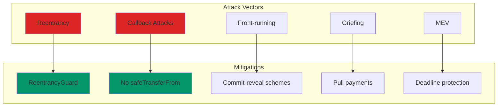
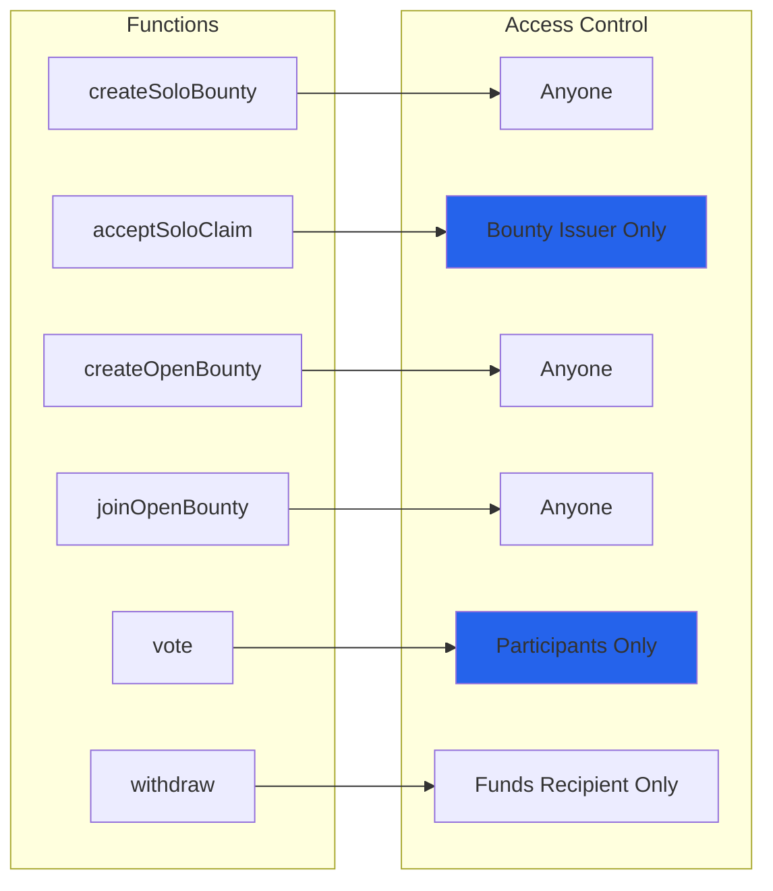

# Security

## Overview

POIDH v3 implements multiple layers of security to address vulnerabilities discovered in v2. This document outlines the security architecture, threat models, and mitigation strategies.

## Critical Security Improvements

### 1. Reentrancy Protection

All state-changing external functions are protected by OpenZeppelin's `ReentrancyGuard`:

```solidity
function example() external nonReentrant {
    // Checks
    // Effects
    // Interactions
}
```

**Mitigates**: Reentrancy attacks during external calls

### 2. Pull Payment System

No direct ETH transfers to users:

```solidity
// Instead of push payments:
// payable(recipient).transfer(amount); // ❌ VULNERABLE

// We use pull payments:
pendingWithdrawals[recipient] += amount; // ✅ SECURE
```

Users must explicitly call `withdraw()` to claim funds.

**Mitigates**: Reentrancy during ETH transfers, gas griefing

### 3. Strict CEI Pattern

All functions follow Checks-Effects-Interactions ordering:

```solidity
function acceptSoloClaim(uint256 bountyId, uint256 claimId) 
    external 
    nonReentrant 
{
    // 1. CHECKS
    Bounty storage bounty = bounties[bountyId];
    require(bounty.issuer == msg.sender, "Not issuer");
    require(bounty.claimer == address(0), "Already claimed");
    
    // 2. EFFECTS
    bounty.claimer = claims[claimId].issuer;
    bounty.amount = 0;
    claims[claimId].accepted = true;
    pendingWithdrawals[claims[claimId].issuer] += bounty.amount;
    
    // 3. INTERACTIONS
    poidhNft.transferFrom(address(this), bounty.issuer, claimId);
}
```

**Mitigates**: State manipulation during callbacks

### 4. Callback-Free NFT Transfers

Claim NFTs use `transferFrom` instead of `safeTransferFrom`:

```solidity
// Mint directly to contract (no callback)
poidhNft.mint(address(this), tokenId);

// Transfer without callback
poidhNft.transferFrom(address(this), recipient, tokenId);
```

**Mitigates**: Malicious contract callbacks during NFT transfers

## Threat Model

### External Threats



### Known Vulnerabilities Addressed

#### V2 Exploit: ERC721 Callback Reentrancy

**Description**: Attacker created malicious contract that reentered during `safeTransferFrom` in claim acceptance.

**V3 Fix**:
- Removed `safeTransferFrom`
- Use `transferFrom` (no callback)
- Mint NFTs directly to contract
- All functions `nonReentrant`

#### V2 Exploit: Incomplete State Finalization

**Description**: State updates after external calls allowed manipulation.

**V3 Fix**:
- Strict CEI pattern
- All state changes before external calls
- `bounty.amount = 0` before any transfers

## Security Properties

### Invariants

The following invariants are maintained and tested:

1. **Bounty Total Invariant**: Sum of contributions = bounty amount
2. **Withdrawal Invariant**: Total pending withdrawals = contract ETH balance
3. **Participant Invariant**: `participants.length - freeParticipantSlots.length` = active participants
4. **Claim Uniqueness**: Each claim can only be accepted once
5. **Voting Weight**: Total votes = sum of participant contributions

### Access Control



## Testing Coverage

### Unit Tests

- ✅ All function paths
- ✅ Access control
- ✅ Input validation
- ✅ State transitions

### Fuzz Tests

- ✅ Randomized inputs
- ✅ Property-based testing
- ✅ Invariant checking

### Invariant Tests

- ✅ Withdrawal invariant
- ✅ Participant invariant
- ✅ Bounty total invariant

### Red Team Tests

- ✅ V2 exploit reproduction
- ✅ Reentrancy attempts
- ✅ Callback attacks
- ✅ Front-running scenarios

## Remaining Risks

### Economic Griefing

**Risk**: Participants can vote maliciously to reject valid claims.

**Mitigation**: 
- Weighted voting (larger contributors have more influence)
- No financial penalty for rejected claims
- Claimants can resubmit

### Liveness Risk

**Risk**: Open bounties with no voting activity stall permanently.

**Mitigation**:
- `resetVotingPeriod` allows extending voting window
- Bounty issuer can cancel after voting expires

### MEV Exposure

**Risk**: Front-running of last-minute votes, claim submissions.

**Mitigation**:
- Fixed voting period (2 days)
- Vote weight = contribution (hard to game last-minute)
- No immediate execution on vote completion

### Admin Key Risk

**Risk**: Treasury address and voting period are immutable after deployment.

**Mitigation**:
- Immutable = no rug risk
- Multi-sig treasury recommended
- Clear documentation of parameters

## Security Checklist

### Pre-Deployment

- [x] All tests passing
- [x] 95%+ code coverage
- [x] Fuzz tests run with 10,000+ runs
- [x] Invariant tests run with 2,000+ runs
- [x] Manual code review completed
- [x] Security report reviewed

### Post-Deployment

- [ ] Monitor for unusual activity
- [ ] Watch for gas spikes
- [ ] Track bounty/claim volumes
- [ ] Monitor voting patterns
- [ ] Audit trail for all transactions

### Incident Response

If vulnerability discovered:

1. Pause protocol (if pause mechanism added)
2. Alert community
3. Deploy fix
4. Migrate to new contract
5. Post-mortem

## Audit Status

**Status**: Not audited by professional firm

**Recommendation**: Obtain professional audit before mainnet deployment with significant value.

**Self-Review**: Comprehensive security review conducted, documented in [docs/POIDH_V3_SECURITY_REPORT.md`](https://github.com/picsoritdidnthappen/poidh-v3/blob/main/docs/POIDH_V3_SECURITY_REPORT.md)

## Additional Resources

- Security Report: Available in project docs
- Mainnet Readiness: Available in project docs
- Test Results: Available in project docs
- Vulnerability Reporting: See SECURITY.md in project root
