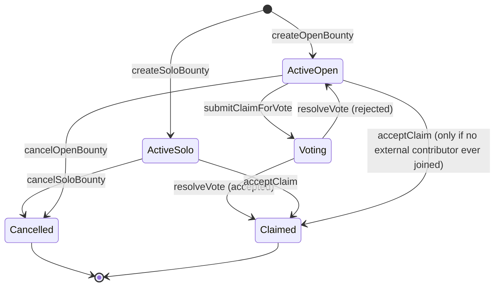
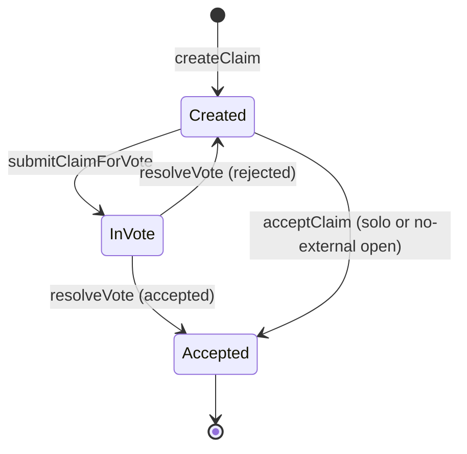
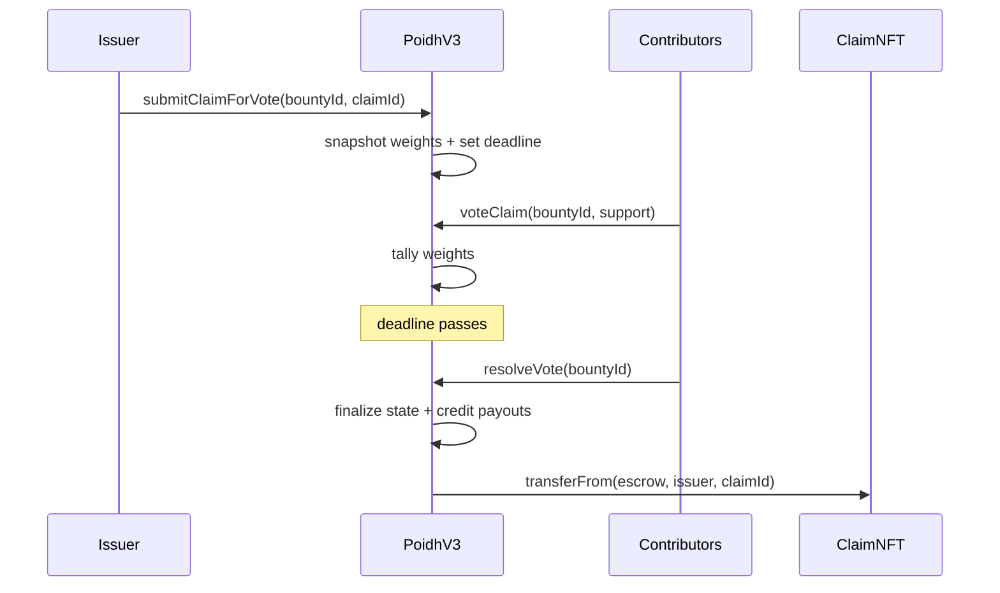
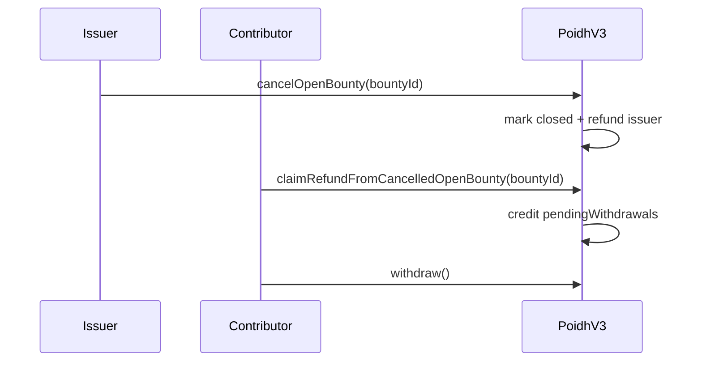

# Integration Guide (POIDH v3)

This guide is for frontend, indexer, and backend teams integrating POIDH v3. It covers user
flows, onchain calls, and the contract state model. The system is **fully immutable**: there is
no owner and no admin wiring function after deployment.

---

## Core Contracts

- `PoidhV3` (`src/PoidhV3.sol`): bounty escrow, voting, pull-payments.
- `PoidhClaimNFT` (`src/PoidhClaimNFT.sol`): claim NFT, minted to escrow and transferred on
  acceptance.

### Immutable Parameters (read onchain)

- `PoidhV3.MIN_BOUNTY_AMOUNT()` (wei)
- `PoidhV3.MIN_CONTRIBUTION()` (wei)
- `PoidhV3.FEE_BPS()` (250)
- `PoidhV3.BPS_DENOM()` (10_000)
- `PoidhV3.MAX_PARTICIPANTS()` (150)
- `PoidhV3.votingPeriod()` (2 days)

Chain defaults (deployment scripts):
- Base, Arbitrum, Base Sepolia:
  - `MIN_BOUNTY_AMOUNT = 0.001 ether`
  - `MIN_CONTRIBUTION = 0.00001 ether`
- Degenchain:
  - `MIN_BOUNTY_AMOUNT = 1 ether` (1 DEGEN)
  - `MIN_CONTRIBUTION = 1 ether` (1 DEGEN)

---

## Roles

- **Issuer**: creates a bounty (solo or open), can cancel, and can accept claims in eligible cases.
- **Contributor**: joins open bounties, votes, and can withdraw/refund.
- **Claimant**: submits claims and receives payout if accepted.

---

## UX Flows (Detailed)

### 1) Create Solo Bounty

**UX:** “Create bounty (solo)” form with title, description, amount.

**Calls:**
- `PoidhV3.createSoloBounty(title, description)` with `msg.value >= MIN_BOUNTY_AMOUNT`

**Guards:**
- EOAs only (`msg.sender == tx.origin`)
- `msg.value > 0` and `>= MIN_BOUNTY_AMOUNT`

**Events:**
- `BountyCreated`

### 2) Create Open Bounty

**UX:** “Create bounty (open)” with title, description, amount.

**Calls:**
- `PoidhV3.createOpenBounty(title, description)` with `msg.value >= MIN_BOUNTY_AMOUNT`

**Effects:**
- Issuer is the first participant (slot 0) with the initial amount.

**Events:**
- `BountyCreated`

### 3) Join Open Bounty

**UX:** “Contribute” action on open bounty.

**Calls:**
- `PoidhV3.joinOpenBounty(bountyId)` with `msg.value >= MIN_CONTRIBUTION`

**Guards:**
- No vote active for this bounty.
- `participants[bountyId].length > 0` (open bounty).
- `msg.sender` cannot be the issuer.

**Events:**
- `BountyJoined` (includes `latestBountyBalance`)

### 4) Withdraw From Open Bounty

**UX:** “Withdraw contribution” button (open bounty, no vote active).

**Calls:**
- `PoidhV3.withdrawFromOpenBounty(bountyId)`
- Then `PoidhV3.withdraw()` or `withdrawTo(address)`

**Events:**
- `WithdrawFromOpenBounty` (includes `latestBountyAmount`)
- `Withdrawal` / `WithdrawalTo`

### 5) Create Claim (for any active bounty)

**UX:** “Submit claim” with title, description, and proof URI.

**Calls:**
- `PoidhV3.createClaim(bountyId, title, description, imageUri)`

**Effects:**
- Claim NFT minted to escrow (`PoidhV3`) via `PoidhClaimNFT.mintToEscrow`.

**Events:**
- `ClaimCreated` (includes `imageUri`)

### 6) Accept Claim (Solo or Open-But-Never-External)

**UX:** Issuer sees “Accept claim” for solo bounties (or open bounties that never had external
contributors).

**Calls:**
- `PoidhV3.acceptClaim(bountyId, claimId)` (issuer only)

**Effects:**
- Claim is finalized, payout credited to claimant, fee credited to treasury.
- Claim NFT transferred from escrow to issuer.

**Events:**
- `ClaimAccepted`
- `VotingResolved` (only if acceptance happens via vote resolution)

### 7) Submit Claim For Vote (Open Bounty)

**UX:** Issuer selects a claim and starts voting.

**Calls:**
- `PoidhV3.submitClaimForVote(bountyId, claimId)`

**Guards:**
- Open bounty only, issuer-only.
- Claim must belong to bounty and not be accepted.

**Effects:**
- Snapshot of participant weights.
- Voting deadline = `block.timestamp + votingPeriod`.

**Events:**
- `VotingStarted` (includes `round`)

### 8) Vote on Claim

**UX:** Contributors see “Vote yes/no” during voting window.

**Calls:**
- `PoidhV3.voteClaim(bountyId, support)`

**Guards:**
- Vote is active and not ended.
- Only participants with a snapshot weight can vote.
- One vote per round.

**Events:**
- `VoteCast`

### 9) Resolve Vote

**UX:** “Resolve vote” available after deadline (anyone can call).

**Calls:**
- `PoidhV3.resolveVote(bountyId)`

**Effects:**
- If yes > 50% of (yes+no), claim accepted and NFT transferred.
- Otherwise claim stays unaccepted, bounty remains open.

**Events:**
- `VotingResolved`

### 9b) Reset Vote (Compatibility)

**UX:** Optional “Reset vote” action after a vote ends and would not pass. This exists for
ABI/indexer compatibility; most integrations can just call `resolveVote`.

**Calls:**
- `PoidhV3.resetVotingPeriod(bountyId)`

**Guards:**
- Open bounty only.
- Vote must be finished.
- Vote would **not** pass (otherwise it reverts).

**Effects:**
- Clears the current voting claim and tracker (same end-state as a rejected `resolveVote`).

**Events:**
- `VotingResolved`

### 10) Cancel Bounty

**Solo cancel (issuer-only):**
- `PoidhV3.cancelSoloBounty(bountyId)`

**Open cancel (issuer-only):**
- `PoidhV3.cancelOpenBounty(bountyId)`
- Contributors must claim refunds individually:
  - `PoidhV3.claimRefundFromCancelledOpenBounty(bountyId)`

**Events:**
- `BountyCancelled`
- `RefundClaimed`

### 11) Withdraw Pending Funds

**UX:** “Withdraw” button that calls pull-payment.

**Calls:**
- `PoidhV3.withdraw()` or `PoidhV3.withdrawTo(address)`

**Events:**
- `Withdrawal` and (optionally) `WithdrawalTo`

---

## State Model (Mermaid)

### Bounty State (High-Level)

### Claim State (Per Claim)

### Vote Resolution (Sequence)

### Cancel + Refund (Sequence)

---

## Indexing & Data Access

### Primary Event Streams

- `BountyCreated` (new bounty)
- `ClaimCreated` (new claim)
- `VotingStarted`, `VoteCast`, `VotingResolved`
- `ClaimAccepted`
- `BountyCancelled`, `RefundClaimed`
- `WithdrawFromOpenBounty`, `Withdrawal`, `WithdrawalTo`
- `Transfer` events from `PoidhClaimNFT` (escrow mint + final transfer)

### Event Payload Notes

- `BountyCreated` includes `isOpenBounty` and the bounty `title`.
- `ClaimCreated` includes `imageUri`.
- `BountyJoined` and `WithdrawFromOpenBounty` include the latest bounty amount after the change.
- `VotingStarted` includes `round` and the issuer's auto-yes weight.

### Read Helpers (Pagination)

- `getBounties(offset)` → last 10 bounties, newest-first
- `getClaimsByBountyId(bountyId, offset)` → last 10 claims for bounty
- `getBountiesByUser(user, offset)` / `getClaimsByUser(user, offset)`
- `getParticipantsPaged(bountyId, offset, limit)`

### UI/Indexer Notes

- Claim IDs start at `POIDH_START_CLAIM_INDEX` (claim `0` is reserved).
- Bounties and claims are stored in arrays; pagination calls return up to 10 items.
- `bountyCurrentVotingClaim[bountyId] == 0` means no active vote.
- `claim.accepted` is only true after acceptance; rejected claims remain unaccepted.

---

## UX Guardrails & Error Handling

- Reject contract issuers (`msg.sender == tx.origin`): show a clear error if user is a smart
  wallet or contract.
- Hide join/withdraw while voting is active (expect `VotingOngoing`).
- Hide accept for open bounties if `everHadExternalContributor == true`.
- Validate user ETH balance and min amounts in UI before submitting.

---

## Deployment Integration Notes

The NFT’s `poidh` address is immutable at deployment. Deployment must:

1. Precompute the PoidhV3 address.
2. Deploy `PoidhClaimNFT` with that address.
3. Deploy `PoidhV3` with the NFT address.

The provided scripts (`script/Deploy.s.sol` and `script/deploy/*.s.sol`) implement this flow.
